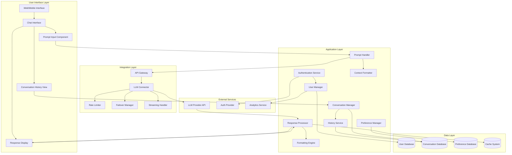

Based on the Chat App PRD, here's a Mermaid diagram depicting the main architectural components:

This diagram shows the main architectural components of the Chat App organized in layers:

1. **User Interface Layer**: Handles all user interactions
2. **Application Layer**: Contains core business logic and application services
3. **Integration Layer**: Manages communication with external LLM services
4. **Data Layer**: Stores and retrieves application data
5. **External Services**: Third-party services the application interacts with

The arrows represent the flow of data and dependencies between components. This architecture supports the requirements outlined in the PRD, including user management, conversation history, LLM integration, and response formatting.
Add to Conversation

